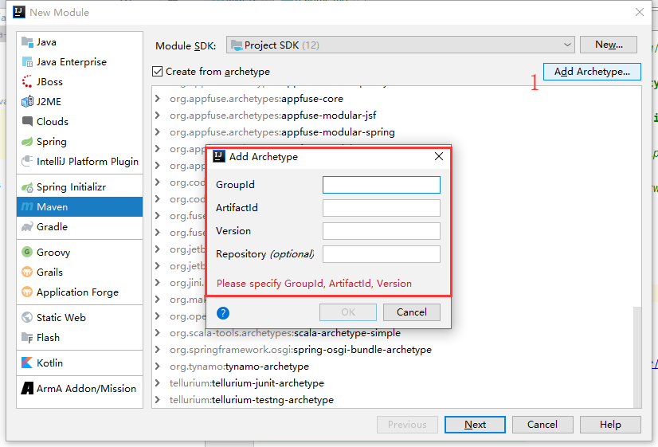
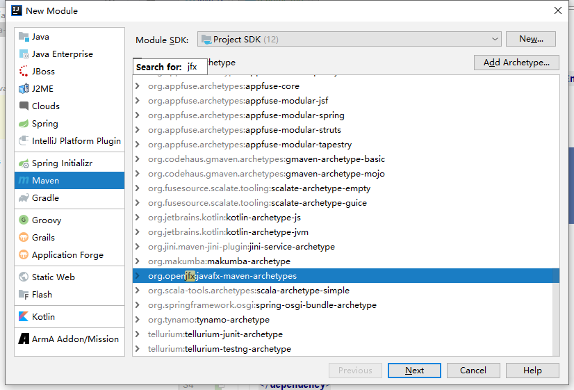
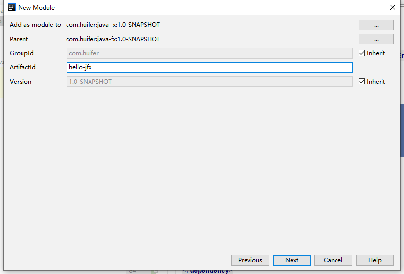
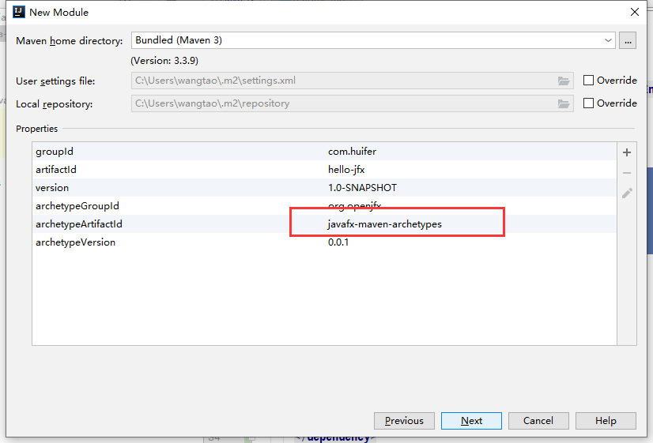
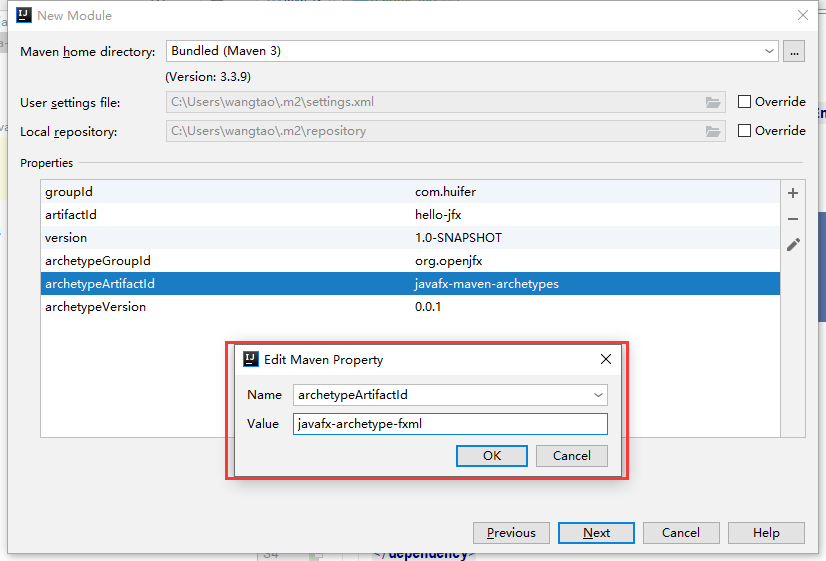
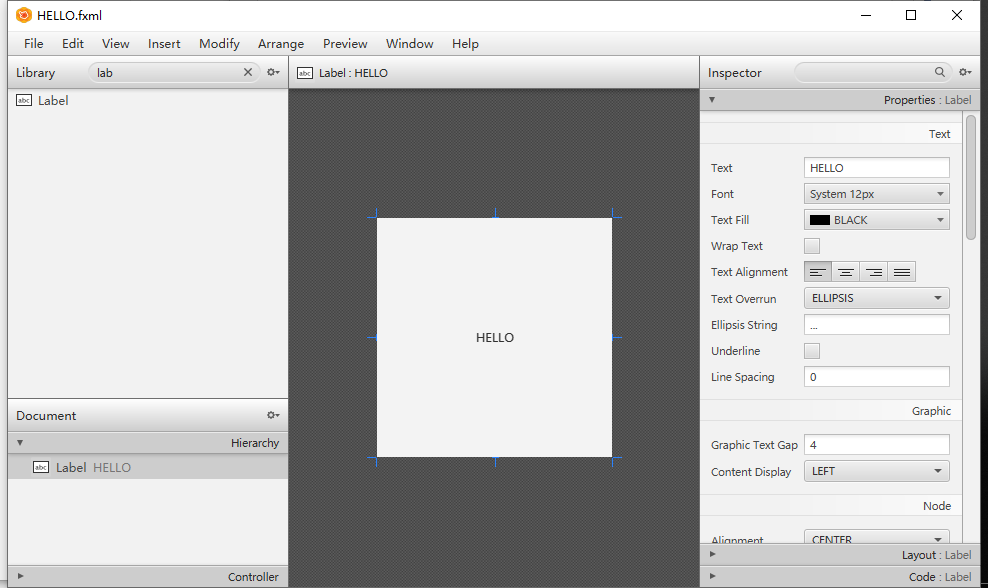
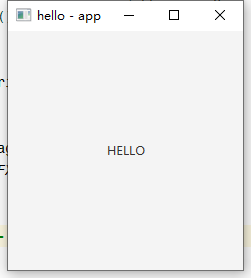

# hello java fx
## java-fx 是什么

> **JavaFX** is a [software platform](https://en.wikipedia.org/wiki/Computing_platform) for creating and delivering [desktop applications](https://en.wikipedia.org/wiki/Application_software), as well as [rich Internet applications (RIAs)](https://en.wikipedia.org/wiki/Rich_Internet_application) that can run across a wide variety of devices. JavaFX is intended to replace [Swing](https://en.wikipedia.org/wiki/Swing_(Java)) as the standard [GUI](https://en.wikipedia.org/wiki/Graphical_User_Interface) library for [Java SE](https://en.wikipedia.org/wiki/Java_Platform,_Standard_Edition), but both will be included for the foreseeable future.[[3\]](https://en.wikipedia.org/wiki/JavaFX#cite_note-FAQs-3)JavaFX has support for [desktop computers](https://en.wikipedia.org/wiki/Desktop_computer) and [web browsers](https://en.wikipedia.org/wiki/Web_browser) on [Microsoft Windows](https://en.wikipedia.org/wiki/Microsoft_Windows), [Linux](https://en.wikipedia.org/wiki/Linux), and [macOS](https://en.wikipedia.org/wiki/MacOS). JavaFX is no longer bundled with the latest Java, nor will be supported by Oracle, while it still is supported for the current long-term version Java SE 8 through March 2022.
>
> Before version 2.0 of JavaFX, developers used a statically typed, declarative language called [JavaFX Script](https://en.wikipedia.org/wiki/JavaFX_Script) to build JavaFX applications. Because JavaFX Script was compiled to [Java bytecode](https://en.wikipedia.org/wiki/Java_bytecode), programmers could also use [Java](https://en.wikipedia.org/wiki/Java_Runtime_Environment) code instead. JavaFX applications could run on any desktop that could run [Java SE](https://en.wikipedia.org/wiki/Java_SE) or on any mobile phone that could run [Java ME](https://en.wikipedia.org/wiki/Java_ME).[*citation needed*]
>
> [JavaFX 2.0](https://docs.oracle.com/javafx/2) and later is implemented as a "native" Java library, and applications using JavaFX are written in "native" Java code. JavaFX Script has been scrapped by Oracle, but development is being continued in the Visage project.[[4\]](https://en.wikipedia.org/wiki/JavaFX#cite_note-4) JavaFX 2.x does not support the [Solaris operating system](https://en.wikipedia.org/wiki/Solaris_(operating_system)) or [mobile phones](https://en.wikipedia.org/wiki/Mobile_phone); however, Oracle plans to integrate JavaFX to Java SE Embedded 8, and Java FX for [ARM](https://en.wikipedia.org/wiki/ARM_architecture) processors is in developer preview phase.[[5\]](https://en.wikipedia.org/wiki/JavaFX#cite_note-5)
>
> On desktops, JavaFX supports [Windows Vista](https://en.wikipedia.org/wiki/Windows_Vista), [Windows 7](https://en.wikipedia.org/wiki/Windows_7), [Windows 8](https://en.wikipedia.org/wiki/Windows_8), [Windows 10](https://en.wikipedia.org/wiki/Windows_10),[[6\]](https://en.wikipedia.org/wiki/JavaFX#cite_note-6) [macOS](https://en.wikipedia.org/wiki/MacOS) and [Linux](https://en.wikipedia.org/wiki/Linux) operating systems.[[7\]](https://en.wikipedia.org/wiki/JavaFX#cite_note-supportedOSes-7) Beginning with JavaFX 1.2, [Oracle](https://en.wikipedia.org/wiki/Oracle_Corporation) has released beta versions for [OpenSolaris](https://en.wikipedia.org/wiki/OpenSolaris).[[8\]](https://en.wikipedia.org/wiki/JavaFX#cite_note-linuxsupport-8) On mobile, [JavaFX Mobile](https://en.wikipedia.org/wiki/JavaFX_Mobile) 1.x is capable of running on multiple mobile [operating systems](https://en.wikipedia.org/wiki/Operating_systems), including [Symbian OS](https://en.wikipedia.org/wiki/Symbian), [Windows Mobile](https://en.wikipedia.org/wiki/Windows_Mobile), and proprietary [real-time operating systems](https://en.wikipedia.org/wiki/Real-time_operating_system).
>
> [Open-source](https://en.wikipedia.org/wiki/Open-source_software) JavaFXPorts works for iOS (iPhone and iPad) and Android and embedded ([Raspberry Pi](https://en.wikipedia.org/wiki/Raspberry_Pi));[[9\]](https://en.wikipedia.org/wiki/JavaFX#cite_note-9) and the related commercial software created under the name "Gluon" supports the same mobile platforms with additional features plus desktop.[[10\]](https://en.wikipedia.org/wiki/JavaFX#cite_note-gluonhq.com-10) This allows a single source code base to create applications for the desktop, iOS, and Android devices.
>
> 链接：<https://en.wikipedia.org/wiki/JavaFX>

简单说JavaFx 就是一个桌面窗口开发框架

## 环境配置

1. JDK>=1.8
2. IDEA
3. [Scene Builder](<https://gluonhq.com/products/scene-builder/>)

安装IDEA 和 Scene Builder 后进行配置，配置如下


## hello-world

- IDEA maven  add archetype




```xml
      <dependency>
        <groupId>org.openjfx</groupId>
        <artifactId>javafx-maven-archetypes</artifactId>
        <version>0.0.1</version>
      </dependency>
```

- 添加完成后如下

  

- 创建maven工厂

  - 
  - 这个地方需要修改成fxml

  - archetypeArtifactId :javafx-archetype-fxml

- 耐心等待模块下载

### 创建一个窗口

- 简单案例就添加一个Label 显示一下 Hello 文字



### 运行一个窗口

- 代码编辑，读取fxml文件并展示到窗口中

  ```java
  package com.huifer;
  
  import javafx.application.Application;
  import javafx.fxml.FXMLLoader;
  import javafx.scene.Parent;
  import javafx.scene.Scene;
  import javafx.stage.Stage;
  
  import java.io.IOException;
  
  /**
   * JavaFX App
   */
  public class App extends Application {
  
      private static Scene scene;
  
      static void setRoot(String fxml) throws IOException {
          scene.setRoot(loadFXML(fxml));
      }
  
      private static Parent loadFXML(String fxml) throws IOException {
          FXMLLoader fxmlLoader = new FXMLLoader(App.class.getResource(fxml + ".fxml"));
          return fxmlLoader.load();
      }
  
      public static void main(String[] args) {
          launch();
      }
  
      @Override
      public void start(Stage stage) throws IOException {
          scene = new Scene(loadFXML("HELLO"));
  
          stage.setScene(scene);
          stage.setTitle("hello - app");
          stage.show();
      }
  
  }
  
  ```




