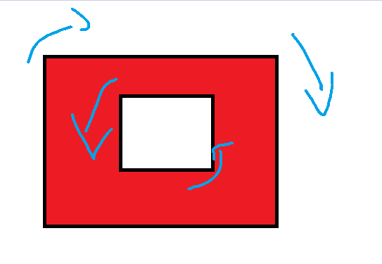

# Polygon

## 什么是Polygon

- 多边形由一组环定义，每一个环都是连续线段的集合，起点和终点相同
- 外顺内逆的规则
  - 

## 表述方式

[ESRI官网的描述](https://developers.arcgis.com/web-map-specification/objects/polygon_geometry/)

```json
{
	"hasZ": true,
	"hasM": true,
	"rings": [
		[
			[x11_1, y11_1, z11_1],
			[x21_1, y21_1, z21_1],
			[x31_1, y31_1, z31_1],
			[x11_1, y11_1, z11_1],
		],
		[
			[x11_2, y11_2, z11_2],
			[x21_2, y21_2, z21_2],
			[x31_2, y31_2, z31_2],
			[x11_2, y11_2, z11_2],
		]
	],
	"spatialReference": {
		"wkid": 4326
	}
}

```

| 属性             | 含义                       | 填写内容                                     |
| ---------------- | -------------------------- | -------------------------------------------- |
| hasZ             | 是否包含Z坐标              | true\false                                   |
| hasM             | 是否包含M坐标              | true\false                                   |
| rings            | 环的集合                   | [[第一个环的坐标集合]，[第二个环的坐标集合]] |
| spatialReference | 通常填写wkid用来表示坐标系 | “wkid”:4326                                  |


## 代码相关

```java
package com.huifer.geometry;

import com.esri.core.geometry.GeoJsonImportFlags;
import com.esri.core.geometry.Geometry;
import com.esri.core.geometry.MapGeometry;
import com.esri.core.geometry.OperatorImportFromGeoJson;
import com.esri.core.geometry.OperatorImportFromJson;
import com.esri.core.geometry.OperatorImportFromWkt;
import com.esri.core.geometry.Polygon;
import com.esri.core.geometry.WktImportFlags;

/**
 * <p>Title : EsriPolygon </p>
 * <p>Description : polygon</p>
 *
 * @author huifer
 * @date 2019-05-07
 */
public class EsriPolygon {

    public static void main(String[] args) {
        createPolygonFromJson();
        createPolygonFromGeoJson();
        createPolygonFromWkt();
    }

    private static void createPolygonFromWkt() {
        String wktString = "MULTIPOLYGON (((120 30 ,121 32 ,123 33,120 30)))";

        Geometry geom = OperatorImportFromWkt
                .local()
                .execute(WktImportFlags.wktImportDefaults, Geometry.Type.Polygon, wktString, null);

        Polygon pg = (Polygon) geom;
        System.out.println(pg);
    }

    private static void createPolygonFromGeoJson() {
        //language=JSON
        String pgGeojson = "{\n"
                + "\t\"type\": \"MultiPolygon\",\n"
                + "\t\"coordinates\": [\n"
                + "\t\t[\n"
                + "\t\t\t[\n"
                + "\t\t\t\t[120, 30],\n"
                + "\t\t\t\t[121, 33],\n"
                + "\t\t\t\t[122, 35],\n"
                + "\t\t\t\t[120, 30]\n"
                + "\n"
                + "\t\t\t],\n"
                + "\t\t\t[\n"
                + "\t\t\t\t[120, 30],\n"
                + "\t\t\t\t[122, 33],\n"
                + "\t\t\t\t[122, 35],\n"
                + "\t\t\t\t[120, 30]\n"
                + "\t\t\t]\n"
                + "\t\t]\n"
                + "\n"
                + "\t],\n"
                + "\t\"crs\": \"EPSG:4326\"\n"
                + "}";
        MapGeometry geom = OperatorImportFromGeoJson
                .local()
                .execute(GeoJsonImportFlags.geoJsonImportDefaults, Geometry.Type.Polygon, pgGeojson,
                        null);

        Polygon pg = (Polygon) geom.getGeometry();
        System.out.println(pg);
    }

    private static void createPolygonFromJson() {
        //language=JSON
        String pgJson = "{\n"
                + "  \"rings\": [\n"
                + "    [\n"
                + "      [120,30],\n"
                + "      [122,33],\n"
                + "      [124,31],\n"
                + "      [120,30]\n"
                + "    ]\n"
                + "  ],\n"
                + "  \"spatialReference\": {\n"
                + "    \"wkid\": 4326\n"
                + "  }\n"
                + "}";
        MapGeometry geom = OperatorImportFromJson
                .local().execute(Geometry.Type.Polygon, pgJson);

        Polygon pg = (Polygon) geom.getGeometry();
        System.out.println(pg);
    }

}
```

