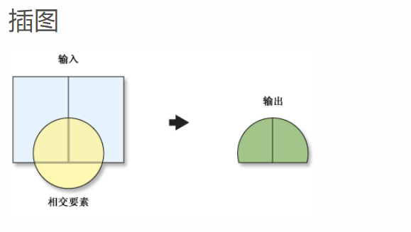

# instersection 相交 
[ArcMap相交](http://desktop.arcgis.com/zh-cn/arcmap/10.3/tools/analysis-toolbox/intersect.htm)





```java
	/**
	 *Performs the Topological intersection operation on the geometry set.
	 *@param input_geometries is the set of Geometry instances to be intersected by the intersector.
	 *@param intersector is the intersector Geometry. Only single intersector is used, therefore, the intersector.next() is called only once.
	 *@param sr The spatial reference is used to get tolerance value. Can be null, then the tolerance is not used and the operation is performed with
	 *a small tolerance value just enough to make the operation robust.
	 *@param progress_tracker Allows to cancel the operation. Can be null.
	 *@param dimensionMask The dimension of the intersection. The value is either -1, or a bitmask mask of values (1 &lt;&lt; dim).
	 *The value of -1 means the lower dimension in the intersecting pair.
	 *This is a fastest option when intersecting polygons with polygons or polylines.
	 *The bitmask of values (1 &lt;&lt; dim), where dim is the desired dimension value, is used to indicate
	 *what dimensions of geometry one wants to be returned. For example, to return
	 *multipoints and lines only, pass (1 &lt;&lt; 0) | (1 &lt;&lt; 1), which is equivalen to 1 | 2, or 3.
	 *@return Returns the cursor of the intersection result. The cursors' getGeometryID method returns the current ID of the input geometry
	 *being processed. When dimensionMask is a bitmask, there will be n result geometries per one input geometry returned, where n is the number
	 *of bits set in the bitmask. For example, if the dimensionMask is 5, there will be two geometries per one input geometry.
	 *
	 *The operator intersects every geometry in the input_geometries with the first geometry of the intersector and returns the result.
	 *
	 *Note, when the dimensionMask is -1, then for each intersected pair of geometries,
	 *the result has the lower of dimentions of the two geometries. That is, the dimension of the Polyline/Polyline intersection
	 *is always 1 (that is, for polylines it never returns crossing points, but the overlaps only).
	 *If dimensionMask is 7, the operation will return any possible intersections.
	 */
	public abstract GeometryCursor execute(GeometryCursor input_geometries,
			GeometryCursor intersector, SpatialReference sr,
			ProgressTracker progress_tracker, int dimensionMask);

	/**
	 *Performs the Topological Intersection operation on the geometry.
	 *The result has the lower of dimentions of the two geometries. That is, the dimension of the
	 *Polyline/Polyline intersection is always 1 (that is, for polylines it never returns crossing
	 *points, but the overlaps only).
	 *The call is equivalent to calling the overloaded method using cursors:
	 *execute(new SimpleGeometryCursor(input_geometry), new SimpleGeometryCursor(intersector), sr, progress_tracker, mask).next();
	 *where mask can be either -1 or min(1 &lt;&lt; input_geometry.getDimension(), 1 &lt;&lt; intersector.getDimension());
	 *@param inputGeometry is the Geometry instance to be intersected by the intersector.
	 *@param intersector is the intersector Geometry.
	 *@param sr The spatial reference to get the tolerance value from. Can be null, then the tolerance is calculated from the input geometries.
	 *@return Returns the intersected Geometry.
	 */
	public abstract Geometry execute(Geometry inputGeometry,
			Geometry intersector, SpatialReference sr,
			ProgressTracker progressTracker);
```


```java
package com.huifer.geometry.topology;

import com.esri.core.geometry.Geometry;
import com.esri.core.geometry.GeometryCursor;
import com.esri.core.geometry.OperatorExportToWkt;
import com.esri.core.geometry.OperatorIntersection;
import com.esri.core.geometry.Polygon;
import com.esri.core.geometry.Polyline;
import com.esri.core.geometry.SimpleGeometryCursor;
import com.esri.core.geometry.SpatialReference;

/**
 * <p>Title : Intersection </p>
 * <p>Description : 相交操作</p>
 *
 * @author huifer
 * @date 2019-05-08
 */
public class Intersection {

    public static void main(String[] args) {
        double[][] polygon_coords = {{0, 4}, {2, 10}, {8, 12}, {12, 6}, {10, 2}, {4, 0}};
        Polygon polygon = createPolygon(polygon_coords);
        double[][] polyline_coords = {{1, 15}, {3.5, 10.5}, {6.5, 11.5}, {18, 11.5}};

        Polyline polyline = createPolyline(polyline_coords);

        SimpleGeometryCursor inGeoms = new SimpleGeometryCursor(polyline);
        SimpleGeometryCursor intersector = new SimpleGeometryCursor(polygon);
        SpatialReference sr = SpatialReference.create(4326);

        GeometryCursor execute = OperatorIntersection.local()
                .execute(inGeoms, intersector, sr, null);

        Geometry geom = null;
        while ((geom = execute.next()) != null) {
            // 转换成WKT
            String execute1 = OperatorExportToWkt.local().execute(0, geom, null);
            System.out.println(execute1);
        }


    }

    private static Polygon createPolygon(double[][] points) {
        Polygon pg = new Polygon();
        pg.startPath(points[0][0], points[0][1]);

        for (int i = 1; i < points.length; i++) {
            pg.lineTo(points[i][0], points[i][1]);
        }

        return pg;

    }

    public static Polyline createPolyline(double[][] points) {

        Polyline line = new Polyline();

        line.startPath(points[0][0], points[0][1]);

        for (int i = 1; i < points.length; i++) {
            line.lineTo(points[i][0], points[i][1]);
        }

        return line;
    }
}

```
