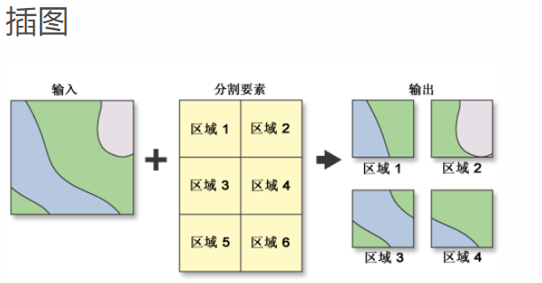

# cut 裁剪

[ArcMap切割](http://desktop.arcgis.com/zh-cn/arcmap/10.3/tools/analysis-toolbox/split.htm)




## 代码实现

- com.esri.core.geometry.OperatorCut#execute 该函数为主要方法

```java
/**
   * Performs the Cut operation on a geometry. 
   * @param bConsiderTouch Indicates whether we consider a touch event a cut. 
   * This only applies to polylines, but it's recommended to set this variable to True. 
   * @param cuttee The input geometry to be cut. 
   * @param cutter The polyline that will be used to divide the cuttee into 
   * pieces where it crosses the cutter. 
   * @return Returns a GeometryCursor of cut geometries. 
   * All left cuts will be grouped together in the first geometry. Right cuts and 
   * coincident cuts are grouped in the second geometry, and each undefined cut along
   * with any uncut parts are output as separate geometries. If there were no cuts
   * the cursor will return no geometry. If the left or right cut does not
   * exist, the returned geometry will be empty for this type of cut. An
   * undefined cut will only be produced if a left cut or right cut was
   * produced and there was a part left over after cutting or a cut is
   * bounded to the left and right of the cutter.
   */
  public abstract GeometryCursor execute(boolean bConsiderTouch,
          Geometry cuttee, Polyline cutter, SpatialReference spatialReference,
          ProgressTracker progressTracker);
```

- 缺陷
  - 剪刀只能是polyline

```java
package com.huifer.geometry.topology;

import com.esri.core.geometry.Geometry;
import com.esri.core.geometry.Geometry.Type;
import com.esri.core.geometry.GeometryCursor;
import com.esri.core.geometry.OperatorCut;
import com.esri.core.geometry.OperatorImportFromWkt;
import com.esri.core.geometry.Polygon;
import com.esri.core.geometry.Polyline;
import com.esri.core.geometry.SpatialReference;
import com.esri.core.geometry.WktImportFlags;

/**
 * <p>Title : Cut </p>
 * <p>Description : 裁剪</p>
 *
 * @author huifer
 * @date 2019-05-08
 */
public class Cut {

    public static void main(String[] args) {
        OperatorCut opCut = OperatorCut.local();
        // cuttee 被切割的物体 类型为(polygon , polyline)
        Polygon cuttee = createPgFromWkt("POLYGON(( 120 30 , 121 32, 110 20, 120 30 ))");
        // cutter 切割的剪刀 类型为( Polyline)
        Polyline cutter = createPolylineFromWKT("LINESTRING( 120 30 , 0 0)");
        // spatialReference 坐标系
        SpatialReference spatialReference = SpatialReference.create(4326);
        GeometryCursor cursor = opCut.execute(true, cuttee, cutter, spatialReference, null);

        // 没有合适的方法读取所有的切割结果，获取的cursor.next()在切割线段的左侧
        Geometry geom = null;
        while ((geom = cursor.next()) != null) {
            System.out.println(geom);
        }

    }

    private static Polygon createPgFromWkt(String pgWkt) {
        Geometry geom = OperatorImportFromWkt
                .local()
                .execute(WktImportFlags.wktImportDefaults, Geometry.Type.Polygon, pgWkt, null);

        Polygon pg = (Polygon) geom;
        return pg;
    }

    private static Polyline createPolylineFromWKT(String plWKT) {
        Geometry geom = OperatorImportFromWkt
                .local().execute(WktImportFlags.wktImportDefaults, Type.Polyline, plWKT, null);
        Polyline geometry = (Polyline) geom;
        return geometry;
    }

}

```
