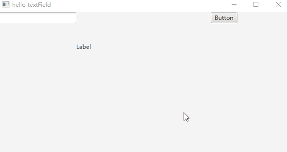
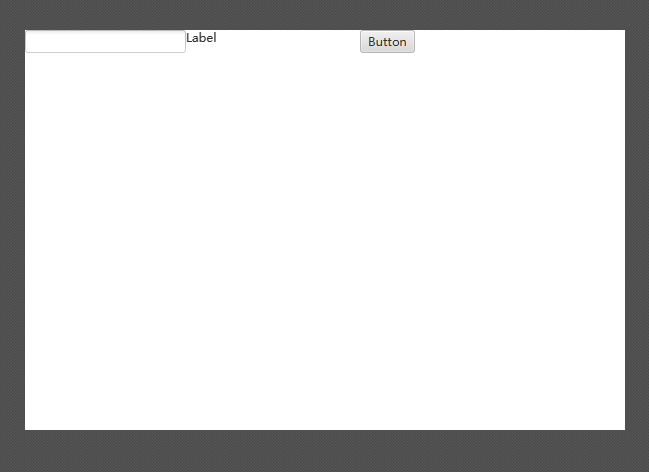
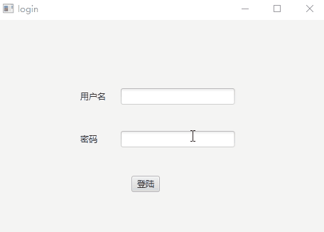
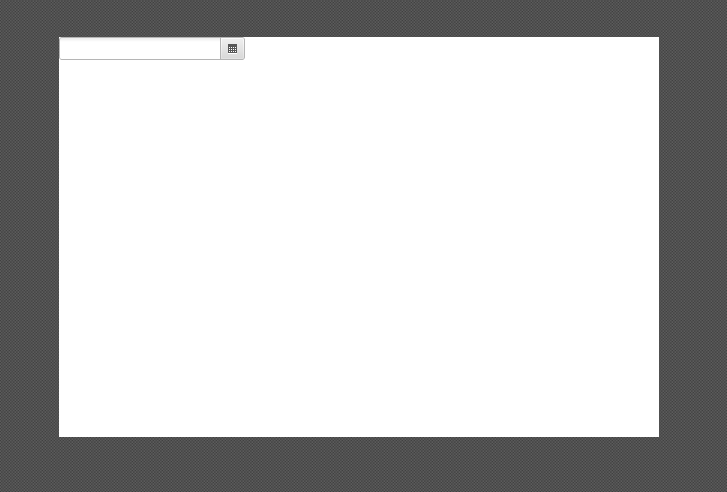

# Java-Fx 控件


## Lable

### fxml 文件


```xml
<?xml version="1.0" encoding="UTF-8"?>

<?import javafx.scene.control.Label?>


<Label prefHeight="139.0" prefWidth="222.0" text="Label" xmlns="http://javafx.com/javafx/11.0.1"
  xmlns:fx="http://javafx.com/fxml/1" />

```

- 需求，将Label 换一个文字


### controller编写

- 操作思路
  1. 获取label 
  2. 修改文字

- 修改fxml 为了让Java类可以获取label 需要给其添加 fx:controller , fx:id 

  ```xml
  <?xml version="1.0" encoding="UTF-8"?>
  
  <?import javafx.scene.control.Label?>
  
  
  <Label prefHeight="139.0" prefWidth="222.0" text="Label" xmlns="http://javafx.com/javafx/11.0.1"
    xmlns:fx="http://javafx.com/fxml/1" fx:controller="com.huifer.LabelController" fx:id="label"/>
  ```

- 定义controller

    ```java
    public class LabelController {

     @FXML
        private Label label;
    
        @FXML
        private void initialize() {
            // fxml load 时候加载此方法
            label.setText("aaaaaaaaaaaaaaaaaaaaa");
        }
    }
    ```
    
    

- 不使用fxml

  ```java
  private void helloLabel1(Stage stage) throws IOException {
      scene = new Scene(new Group());
      stage.setTitle("hello Label");
      stage.setWidth(400);
      stage.setHeight(400);
  
      HBox hBox = new HBox();
      Label label = new Label("标签");
      label.setTextFill(Color.web("#032677"));
      hBox.setSpacing(10);
      hBox.getChildren().add(label);
      ((Group) scene.getRoot()).getChildren().add(hBox);
  
      stage.setScene(scene);
      stage.show();
  
  }
  ```

  

### 总结

- FXML 的初始化


## Button

### fxml文件

用SceneBuild创建一个按钮


```xml
<?xml version="1.0" encoding="UTF-8"?>

<?import javafx.scene.control.Button?>
<?import javafx.scene.control.Label?>
<?import javafx.scene.layout.VBox?>

<VBox alignment="CENTER" maxHeight="-Infinity" maxWidth="-Infinity" minHeight="-Infinity" minWidth="-Infinity" prefHeight="127.0" prefWidth="318.0" xmlns="http://javafx.com/javafx/11.0.1" xmlns:fx="http://javafx.com/fxml/1">
   <children>
      <Label alignment="CENTER" prefHeight="47.0" prefWidth="88.0" text="测试文本" />
      <Button mnemonicParsing="false" text="Button" />
   </children>
</VBox>
```

这样创建完成文件后没有和Java类关联起来,以及按钮的点击功能

1. 按钮的点击事件
2. 修改label 的文本

围绕上述问题进行下一步操作

### controller编写

- 操作流程

	1. 给当前fxml添加一个 controller类
	2. 指定各个控件的id
	3. 给button添加点击事件

- 经过修改后的fxml文件

    ```xml
    <?xml version="1.0" encoding="UTF-8"?>

    <?import javafx.scene.control.Button?>
    <?import javafx.scene.control.Label?>
    <?import javafx.scene.layout.VBox?>

    <VBox alignment="CENTER" maxHeight="-Infinity"
      maxWidth="-Infinity" minHeight="-Infinity"
      minWidth="-Infinity" prefHeight="127.0"
      prefWidth="318.0"
      xmlns="http://javafx.com/javafx/11.0.1" xmlns:fx="http://javafx.com/fxml/1"
      fx:controller="ButtonController"
    >
      <children>
        <Label fx:id="testLabel" alignment="CENTER" prefHeight="47.0" prefWidth="88.0" text="测试文本"/>
        <Button fx:id="button" mnemonicParsing="false" text="Button" onAction="#buttonAction"/>
      </children>
    </VBox>
    ```
    
- ButtonController

    ```java
    package com.huifer;
    
    import javafx.fxml.FXML;
    import javafx.scene.control.Label;
    
    /**
     * <p>Title : ButtonController </p>
     * <p>Description : 按钮控件</p>
     *
     * @author huifer
     * @date 2019-05-10
     */
    public class ButtonController {
    
    
        /**
         * 使用fx:id 以及@FXML 来获取fxml文件中的一个控件
         */
        @FXML
        private Label testLabel;
    
        private Boolean aBoolean = true;
    
    
        /**
         * 用来保定button的点击事件
         */
        @FXML
        private void buttonAction() throws Exception {
            if (aBoolean) {
                aBoolean = false;
                testLabel.setText("button 点击后");
            } else {
                aBoolean = true;
                testLabel.setText("button 点击前");
    
            }
        }
    
    }
    
    ```
    
    
    
- 不适用fxml 文件的方式

    ```java
    private void helloButton2(Stage stage) throws IOException {
    
        stage.setTitle("hello button2");
        Button button = new Button();
    
        button.setText("button");
        button.setOnAction(actionEvent -> System.out.println("button onclick"));
    
        StackPane root = new StackPane();
        root.getChildren().add(button);
        stage.setScene(new Scene(root, 300, 250));
        stage.show();
    
    
    }
    ```
    
    

### 总结

1. fx:id 以及@FXML 的组合使用
2. fx:controller 的使用
3. Button 按钮的点击事件
4. Label的文本设置


## 单选框

### fxml 文件

- 做一个选择性别的单选框，label显示选择结果


- 注意点

  1. 两个RadioButton 需要放到一个 ToggleGroup 中才会有单选的效果

     

     


- 具体文件如下

```xml
<?xml version="1.0" encoding="UTF-8"?>

<?import javafx.scene.control.Label?>
<?import javafx.scene.control.RadioButton?>
<?import javafx.scene.control.ToggleGroup?>
<?import javafx.scene.layout.Pane?>

<Pane maxHeight="-Infinity" maxWidth="-Infinity" minHeight="-Infinity" minWidth="-Infinity" prefHeight="400.0" prefWidth="600.0" xmlns="http://javafx.com/javafx/11.0.1" xmlns:fx="http://javafx.com/fxml/1" fx:controller="com.huifer.RadioButtonController">
   <children>
      <Label layoutX="78.0" layoutY="39.0" text="选择性别" />
      <RadioButton fx:id="r1" layoutX="198.0" layoutY="132.0" mnemonicParsing="false" text="男">
         <toggleGroup>
            <ToggleGroup fx:id="group" />
         </toggleGroup>
      </RadioButton>
      <RadioButton fx:id="r2" layoutX="198.0" layoutY="172.0" mnemonicParsing="false" text="女" toggleGroup="$group" />
      <Label fx:id="showLabel" layoutX="108.0" layoutY="228.0" prefHeight="15.0" prefWidth="161.0" />
   </children>
</Pane>

```


### controller 编写

1. 给两个RadioButton 添加userData  (男,女)
2. 监听ToggleGroup 的改变,即RadioButton的点击情况


```java
package com.huifer;

import javafx.fxml.FXML;
import javafx.scene.control.Label;
import javafx.scene.control.RadioButton;
import javafx.scene.control.ToggleGroup;

/**
 * <p>Title : RadioButtonController </p>
 * <p>Description : 单选框</p>
 *
 * @author huifer
 * @date 2019-05-10
 */
public class RadioButtonController {

    @FXML
    private RadioButton r1;

    @FXML
    private RadioButton r2;

    @FXML
    private ToggleGroup group;

    @FXML
    private Label showLabel;


    @FXML
    void initialize() {
        // 设置真实使用的属性
        r1.setUserData("男");
        r2.setUserData("女");

        // ToggleGroup 监听r1,r2的具体点击情况
        group.selectedToggleProperty().addListener((observableValue, toggle, t1) -> {
            if (group.getSelectedToggle() != null) {
                Object userData = t1.getUserData();
                showLabel.setText(String.valueOf(userData));
            }
        });
    }
}
```


- 不使用fxml

  ```java
  private void helloRadioButtonNotFxml(Stage stage) {
      scene = new Scene(new Group());
      stage.setTitle("hello RadioButton");
      stage.setWidth(400);
      stage.setHeight(400);
  
      ToggleGroup group = new ToggleGroup();
      RadioButton r1 = new RadioButton("r1");
      r1.setToggleGroup(group);
      r1.setUserData("r1");
  
      RadioButton r2 = new RadioButton("r2");
      r2.setToggleGroup(group);
      r2.setUserData("r2");
  
      RadioButton r3 = new RadioButton("r3");
      r3.setToggleGroup(group);
      r3.setUserData("r3");
  
      group.selectedToggleProperty().addListener(new ChangeListener<Toggle>() {
          @Override
          public void changed(ObservableValue<? extends Toggle> observableValue, Toggle toggle,
                  Toggle t1) {
              if (group.getSelectedToggle() != null) {
                  System.out.println(group.getSelectedToggle().getUserData());
                  System.out.println(t1.getUserData().toString());
              }
          }
      });
      HBox hBox = new HBox();
      VBox vBox = new VBox();
  
      vBox.getChildren().add(r1);
      vBox.getChildren().add(r2);
      vBox.getChildren().add(r3);
  
      hBox.getChildren().add(vBox);
  
      hBox.setSpacing(50);
      hBox.setPadding(new Insets(10, 10, 10, 10));
  
      ((Group) scene.getRoot()).getChildren().add(hBox);
  
      stage.setScene(scene);
      stage.show();
  
  }
  ```

### 总结

1. RadioButton 的显示文本和真实使用的文本(本案例使用文本, 实际上可以是Object )不一致
2. 用ToggleGroup来组合RadioButton 达到单选的效果
3. ToggleGroup的监听


## 多选框

### fxml 文件

- 制作一个多选框,用label来显示勾选内容, 最多2个勾选


这次的fxml制作相对简单,只需要加入pane , checkBox , label .难点在controller编写上

```xml
<?xml version="1.0" encoding="UTF-8"?>

<?import javafx.scene.control.Button?>
<?import javafx.scene.control.CheckBox?>
<?import javafx.scene.control.Label?>
<?import javafx.scene.layout.Pane?>

<Pane maxHeight="-Infinity" maxWidth="-Infinity" minHeight="-Infinity" minWidth="-Infinity" prefHeight="400.0" prefWidth="600.0" xmlns="http://javafx.com/javafx/8.0.172-ea" xmlns:fx="http://javafx.com/fxml/1" fx:controller="com.huifer.CheckBoxController">
   <children>
      <CheckBox fx:id="c1" layoutX="179.0" layoutY="124.0" mnemonicParsing="false" text="C1">
      </CheckBox>
      <CheckBox fx:id="c2" layoutX="179.0" layoutY="162.0" mnemonicParsing="false" text="C2">
      </CheckBox>
      <CheckBox fx:id="c3" layoutX="179.0" layoutY="210.0" mnemonicParsing="false" text="C3">
      </CheckBox>
      <Label fx:id="label" layoutX="164.0" layoutY="272.0" text="勾选内容有" />
      <Button fx:id="button" layoutX="148.0" layoutY="308.0" prefHeight="23.0" prefWidth="186.0" text="button" />
   </children>
</Pane>
```

### controller编写

- 编写流程
  1. 装配2个容器,
     1. 一个用来装载选择的checkbox
     2. 一个用来装载未选择的checkbox
  2. 确定按钮应该放在哪一个容器中

```java
package com.huifer;

import javafx.beans.binding.Bindings;
import javafx.beans.binding.IntegerBinding;
import javafx.beans.value.ChangeListener;
import javafx.beans.value.ObservableValue;
import javafx.collections.FXCollections;
import javafx.collections.ObservableSet;
import javafx.event.ActionEvent;
import javafx.event.EventHandler;
import javafx.fxml.FXML;
import javafx.scene.control.Button;
import javafx.scene.control.CheckBox;
import javafx.scene.control.Label;

/**
 * <p>Title : CheckBoxController </p>
 * <p>Description : checkBox</p>
 *
 * @author huifer
 * @date 2019-05-10
 */
public class CheckBoxController {

    @FXML
    private CheckBox c1;
    @FXML
    private CheckBox c2;
    @FXML
    private CheckBox c3;
    @FXML
    private Label label;

    @FXML
    private Button button;

    private ObservableSet<CheckBox> selectedCheckBoxes = FXCollections.observableSet();
    private ObservableSet<CheckBox> unselectedCheckBoxes = FXCollections.observableSet();

    private IntegerBinding numCheckBoxesSelected = Bindings.size(selectedCheckBoxes);

    @FXML
    private void initialize() {
        c1.setUserData("c1");
        c2.setUserData("c2");
        c3.setUserData("c3");
        configureCheckBox(c1);
        configureCheckBox(c2);
        configureCheckBox(c3);

        /**
         * 最多选择2个
         */
        int maxSelect = 2;
        numCheckBoxesSelected.addListener((obs, oldSelectedCount, newSelectedCount) -> {

            String s = selectString();
            label.setText(s);
            if (newSelectedCount.intValue() >= maxSelect) {
                unselectedCheckBoxes.forEach(cb -> cb.setDisable(true));
            } else {
                unselectedCheckBoxes.forEach(cb -> cb.setDisable(false));
            }
        });

        // 题外话: 此处的按钮仅用来形容勾选复选框后的操作
        button.setOnAction(new EventHandler<ActionEvent>() {
            @Override
            public void handle(ActionEvent actionEvent) {

                int size = selectedCheckBoxes.size();
                System.out.println("当前选择的数量" + size);

            }
        });

    }

    private String selectString() {
        StringBuilder sb = new StringBuilder();
        selectedCheckBoxes.forEach(s -> sb.append(s.getUserData()));
        return sb.toString();
    }


    /**
     * 配置选择框到底在那个列表中
     */
    private void configureCheckBox(CheckBox checkBox) {
        if (checkBox.isSelected()) {
            selectedCheckBoxes.add(checkBox);
        } else {
            unselectedCheckBoxes.add(checkBox);
        }

        checkBox.selectedProperty().addListener(new ChangeListener<Boolean>() {
            @Override
            public void changed(ObservableValue<? extends Boolean> observableValue,
                    Boolean wasSelected, Boolean isNowSelected) {
                if (isNowSelected) {
                    unselectedCheckBoxes.remove(checkBox);
                    selectedCheckBoxes.add(checkBox);

                } else {
                    selectedCheckBoxes.remove(checkBox);
                    unselectedCheckBoxes.add(checkBox);
                }
            }
        });

    }
}

```


### 总结

1. 复选框也可以具有onAction事件,但是需要增加太多个,个人认为这些复选框应该作为参数类似java中的不定长参数.
2. ObservableSet集合的使用,复选框的分类,选择的作为一类,未选择的作为一类 


## 下拉选择框

### fxml文件

- 制作一个下拉选择框，右侧label显示选择的内容。
- 使用sceneBulider 来制作这个相对简单，只需要拖动控件到画布中就行。这里有一个问题：下拉框的选择项应该怎么填写，笔者没有找到相关方案。笔者使用的方法是手动修改fxml文件:boom:


```xml
<?xml version="1.0" encoding="UTF-8"?>


<?import java.lang.String?>
<?import javafx.collections.FXCollections?>
<?import javafx.scene.control.ChoiceBox?>
<?import javafx.scene.control.Label?>
<?import javafx.scene.layout.HBox?>
<HBox fx:controller="com.huifer.ChoiceBoxController" maxHeight="-Infinity" maxWidth="-Infinity" minHeight="-Infinity" minWidth="-Infinity" prefHeight="400.0" prefWidth="600.0" xmlns="http://javafx.com/javafx/11.0.1" xmlns:fx="http://javafx.com/fxml/1">
   <children>
      <ChoiceBox fx:id="choiceBox" prefWidth="150.0" >
         <items>
            <FXCollections fx:factory="observableArrayList">
               <String fx:id="c1" fx:value="下拉选择框1"/>
               <String fx:id="c2" fx:value="下拉选择框2"/>
            </FXCollections>
         </items>
      </ChoiceBox>
      <Label fx:id="label" prefHeight="64.0" prefWidth="107.0" text="Label" />
   </children>
</HBox>
```

### controller编写

```java
public class ChoiceBoxController {

    @FXML
    private ChoiceBox choiceBox;
    @FXML
    private Label label;


    @FXML
    private void initialize() {

        ObservableList items = choiceBox.getItems();

        choiceBox.getSelectionModel().selectedIndexProperty().addListener(
                new ChangeListener<Number>() {
                    @Override
                    public void changed(ObservableValue<? extends Number> observableValue,
                            Number number, Number t1) {
                        Object o = items.get(t1.intValue());
                        System.out.println("当前选择" + o);
                        label.setText(String.valueOf(o));
                    }
                });
    }


}
```

- 不使用fxml中的数据自定义 下拉选择框的内容列表

  ```java
  /**
   * 自定义items
   */
  private void userDefinedItems() {
      ObservableList<String> strings = FXCollections.observableArrayList("A", "B", "C", "D");
      choiceBox.setItems(strings);
      choiceBox.getSelectionModel().selectedIndexProperty().addListener(
              new ChangeListener<Number>() {
                  @Override
                  public void changed(ObservableValue<? extends Number> observableValue,
                          Number number, Number t1) {
                      System.out.println("当前选择" + strings.get(t1.intValue()));
  
                      label.setText(String.valueOf(strings.get(t1.intValue())));
                  }
              });
  }
  ```

### 总结

1. scene builder 不一定能给我们提供我们想要的，也许是我没有找到

   ```xml
   <ChoiceBox fx:id="choiceBox" prefWidth="150.0" >
      <items>
         <FXCollections fx:factory="observableArrayList">
            <String fx:id="c1" fx:value="下拉选择框1"/>
            <String fx:id="c2" fx:value="下拉选择框2"/>
         </FXCollections>
      </items>
   </ChoiceBox>
   ```

2. 通常我会在创建fxml的时候一两个下拉选择框，后续使用自定义的方式来补充完整下拉选择框的内容


## 输入框
### fxml文件
- 创建输入框、label、按钮，实现：点击按钮后将输入框的内容显示到label中


```xml
<?xml version="1.0" encoding="UTF-8"?>

<?import javafx.scene.control.Button?>
<?import javafx.scene.control.Label?>
<?import javafx.scene.control.TextField?>
<?import javafx.scene.layout.HBox?>

<HBox maxHeight="-Infinity" maxWidth="-Infinity" minHeight="-Infinity" minWidth="-Infinity" prefHeight="400.0" prefWidth="600.0" xmlns="http://javafx.com/javafx/8.0.172-ea" xmlns:fx="http://javafx.com/fxml/1" fx:controller="com.huifer.TextController">
  <children>
    <TextField fx:id="textField" />
    <Label fx:id="label" prefHeight="142.0" prefWidth="277.0" text="Label" />
      <Button fx:id="button" mnemonicParsing="false" text="Button" />

  </children>
</HBox>
```


### controller编写

```java
package com.huifer;

import javafx.event.ActionEvent;
import javafx.event.EventHandler;
import javafx.fxml.FXML;
import javafx.scene.control.Button;
import javafx.scene.control.Label;
import javafx.scene.control.TextField;

/**
 * <p>Title : TextController </p>
 * <p>Description : 文本输入框</p>
 *
 * @author huifer
 * @date 2019-05-13
 */
public class TextController {

    @FXML
    private TextField textField;

    @FXML
    private Label label;

    @FXML
    private Button button;

    @FXML
    void initialize() {
        button.setOnAction(new EventHandler<ActionEvent>() {
            @Override
            public void handle(ActionEvent actionEvent) {
                label.setText(textField.getText());
            }
        });
    }
}
```



### 总结

1. 将前面学到的按钮、label 配合textField进行使用


## 密码
### fxml文件

- 创建密码输入框、label、按钮，实现：点击按钮后将输入框的内容显示到label中



```xml
<?xml version="1.0" encoding="UTF-8"?>

<?import javafx.scene.control.Button?>
<?import javafx.scene.control.Label?>
<?import javafx.scene.control.PasswordField?>
<?import javafx.scene.layout.HBox?>


<HBox fx:controller="com.huifer.PassWordController" maxHeight="-Infinity" maxWidth="-Infinity"
  minHeight="-Infinity" minWidth="-Infinity" prefHeight="400.0" prefWidth="600.0"
  xmlns="http://javafx.com/javafx/11.0.1" xmlns:fx="http://javafx.com/fxml/1">
  <children>
    <PasswordField fx:id="passwordField"/>
    <Label fx:id="label" prefHeight="15.0" prefWidth="174.0" text="Label"/>
    <Button fx:id="button" mnemonicParsing="false" text="Button"/>
  </children>
</HBox>
```

### controller编写

```java
package com.huifer;

import javafx.event.ActionEvent;
import javafx.event.EventHandler;
import javafx.fxml.FXML;
import javafx.scene.control.Button;
import javafx.scene.control.Label;
import javafx.scene.control.PasswordField;

/**
 * <p>Title : PassWordController </p>
 * <p>Description : password</p>
 *
 * @author huifer
 * @date 2019-05-13
 */
public class PassWordController {


    @FXML
    private PasswordField passwordField;
    @FXML
    private Label label;
    @FXML
    private Button button;

    @FXML
    void initialize() {

        button.setOnAction(new EventHandler<ActionEvent>() {
            @Override
            public void handle(ActionEvent actionEvent) {
                label.setText("密码：" + passwordField.getText());
            }
        });
    }

}
```


### 总结

1. 密码框操作和输入框操作相同


## 登陆实例


- 登陆账号密码校验成功弹出登陆成功，失败则弹出登陆失败

### fxml文件

```xml
<?xml version="1.0" encoding="UTF-8"?>

<?import javafx.scene.control.Button?>
<?import javafx.scene.control.Label?>
<?import javafx.scene.control.PasswordField?>
<?import javafx.scene.control.TextField?>
<?import javafx.scene.layout.Pane?>


<Pane fx:controller="com.huifer.LoginController" maxHeight="-Infinity" maxWidth="-Infinity"
  minHeight="-Infinity" minWidth="-Infinity" prefHeight="305.0" prefWidth="463.0"
  xmlns="http://javafx.com/javafx/11.0.1" xmlns:fx="http://javafx.com/fxml/1">
  <children>
    <Label layoutX="117.0" layoutY="92.0" prefHeight="30.0" prefWidth="72.0" text="用户名"/>
    <Label layoutX="117.0" layoutY="152.0" prefHeight="30.0" prefWidth="72.0" text="密码"/>
    <Button fx:id="loginButton"  layoutX="189.0" layoutY="219.0" mnemonicParsing="false" text="登陆"/>
    <TextField fx:id="user" layoutX="174.0" layoutY="96.0"/>
    <PasswordField fx:id="pwd" layoutX="174.0" layoutY="156.0"/>
  </children>
</Pane>
```


### controller 编写

```java
package com.huifer;

import javafx.event.ActionEvent;
import javafx.event.EventHandler;
import javafx.fxml.FXML;
import javafx.scene.Group;
import javafx.scene.Scene;
import javafx.scene.control.Button;
import javafx.scene.control.Label;
import javafx.scene.control.PasswordField;
import javafx.scene.control.TextField;
import javafx.scene.paint.Color;
import javafx.stage.Stage;

/**
 * <p>Title : LoginController </p>
 * <p>Description : 登陆</p>
 *
 * @author huifer
 * @date 2019-05-13
 */
public class LoginController {

    @FXML
    private Button loginButton;
    @FXML
    private TextField user;
    @FXML
    private PasswordField pwd;


    @FXML
    void initialize() {

        loginButton.setOnAction(new EventHandler<ActionEvent>() {
            @Override
            public void handle(ActionEvent actionEvent) {
                if (user.getText().equals("1") && pwd.getText().equals("1")) {
                    loginInfo("登陆成功");
                } else {
                    loginInfo("登陆失败");
                }
            }
        });


    }

    private void loginInfo(String loginfo) {
        Scene scene = new Scene(new Group());
        Stage stage = new Stage();
        stage.setTitle("登录信息");

        Label label = new Label();
        label.setText(loginfo);
        label.setTextFill(Color.web("#032677"));
        ((Group) scene.getRoot()).getChildren().add(label);

        stage.setScene(scene);
        stage.show();
    }
}
```



### 总结

1. 弹框如何创建，方式有很多本案例选择了之前使用过的label 来作为呈现登陆信息的容器

   

## 文件选择器

- 文件选择器在scene build 中没有 就是用 controller的方式直接编写了

### controller编写

```java
private void helloFileChooser(Stage stage) {
    VBox vbox = new VBox(20);
    Scene scene = new Scene(vbox, 400, 400);
    stage.setScene(scene);

    Button buttonLoad = new Button("Load");
    buttonLoad.setOnAction(new EventHandler<ActionEvent>() {
        @Override
        public void handle(ActionEvent arg0) {
            FileChooser fileChooser = new FileChooser();
            FileChooser.ExtensionFilter extFilter = new FileChooser.ExtensionFilter(
                    "TXT files (*.txt)", "*.txt");
            fileChooser.getExtensionFilters().add(extFilter);
            File file = fileChooser.showOpenDialog(stage);
            System.out.println(file);
        }
    });

    vbox.getChildren().add(buttonLoad);
    stage.show();


}
```


### 总结

1. scene build 不是万能的.


## 时间选择器
### fxml文件

- 创建时间选择器获取选择的时间



```xml
<?xml version="1.0" encoding="UTF-8"?>

<?import javafx.scene.control.DatePicker?>
<?import javafx.scene.layout.VBox?>


<VBox fx:controller="com.huifer.DatePickerController" maxHeight="-Infinity" maxWidth="-Infinity"
  minHeight="-Infinity" minWidth="-Infinity" prefHeight="400.0" prefWidth="600.0"
  xmlns="http://javafx.com/javafx/11.0.1" xmlns:fx="http://javafx.com/fxml/1">
  <children>
    <DatePicker fx:id="datePicker"/>
  </children>
</VBox>
```

### controller编写


```java
package com.huifer;

import java.time.LocalDate;
import javafx.event.ActionEvent;
import javafx.event.EventHandler;
import javafx.fxml.FXML;
import javafx.scene.control.DatePicker;

/**
 * <p>Title : DatePickerController </p>
 * <p>Description : 时间选择器</p>
 *
 * @author huifer
 * @date 2019-05-14
 */
public class DatePickerController {

    @FXML
    private DatePicker datePicker;

    @FXML
    void initialize() {
        datePicker.setOnAction(new EventHandler<ActionEvent>() {
            @Override
            public void handle(ActionEvent actionEvent) {
                LocalDate value = datePicker.getValue();
                System.out.println(value);

            }
        });
    }


}
```


### 总结

1. 使用setOnAction 方法来获取改变的时间


## 菜单
### fxml文件

- 使用scene build 来做效果没有那么好


```xml
<?xml version="1.0" encoding="UTF-8"?>

<?import javafx.scene.control.Menu?>
<?import javafx.scene.control.MenuBar?>
<?import javafx.scene.control.MenuItem?>

<MenuBar fx:controller="com.huifer.MenuController" xmlns:fx="http://javafx.com/fxml/1"
  xmlns="http://javafx.com/javafx/11.0.1">
  <menus>
    <Menu fx:id="menuFile" mnemonicParsing="false" text="File">
      <items>
        <MenuItem fx:id="f1" mnemonicParsing="false" text="菜单1的子菜单"/>
        <Menu fx:id="f2" mnemonicParsing="false" text="menu2"/>
      </items>
    </Menu>
  </menus>
</MenuBar>
```

### controller编写

```java
package com.huifer;

import javafx.event.ActionEvent;
import javafx.event.EventHandler;
import javafx.fxml.FXML;
import javafx.scene.control.CheckMenuItem;
import javafx.scene.control.Menu;
import javafx.scene.control.MenuItem;

/**
 * <p>Title : MenuController </p>
 * <p>Description : 菜单</p>
 *
 * @author huifer
 * @date 2019-05-14
 */
public class MenuController {

    @FXML
    private Menu menuFile;


    @FXML
    private MenuItem f1;

    @FXML
    private Menu f2;


    @FXML
    void initialize() {

        CheckMenuItem c1 = new CheckMenuItem("Java");
        c1.setOnAction(new EventHandler<ActionEvent>() {
            @Override
            public void handle(ActionEvent actionEvent) {
                System.out.println("java");

            }
        });
        f2.getItems().addAll(
                c1,
                new CheckMenuItem("python"),
                new CheckMenuItem("c++"));

        f1.setOnAction(new EventHandler<ActionEvent>() {
            @Override
            public void handle(ActionEvent actionEvent) {
                System.out.println(f1.getText());
            }
        });
    }

}
```


### 总结

1. scene build 不是那么好用 。还是要熟练使用 java-fx 中提供的API