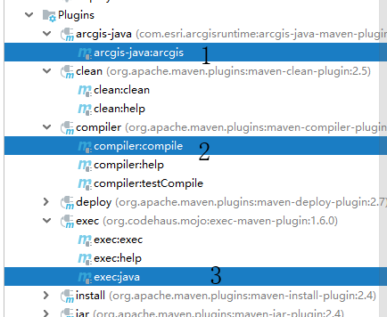
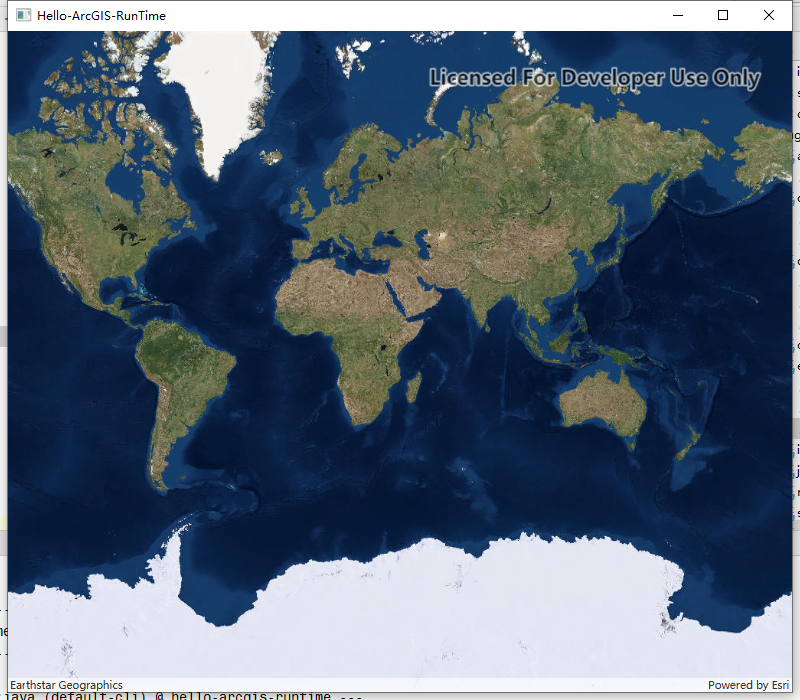
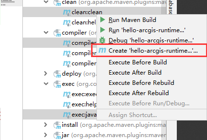
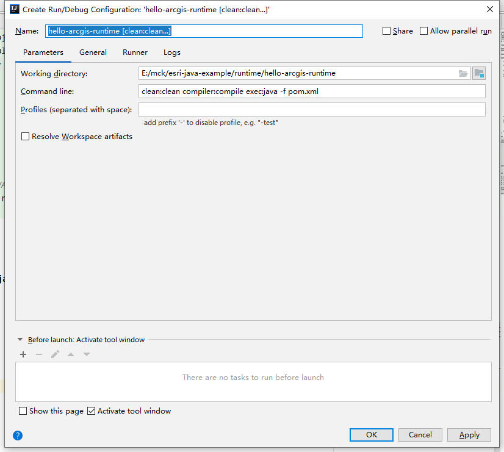
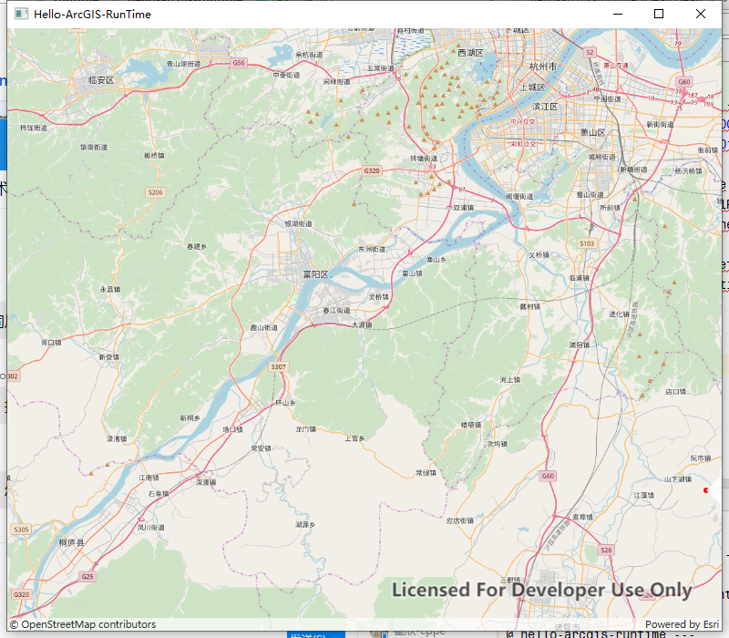
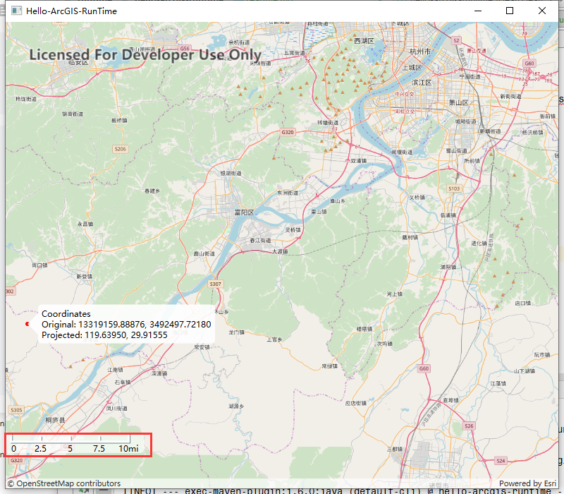
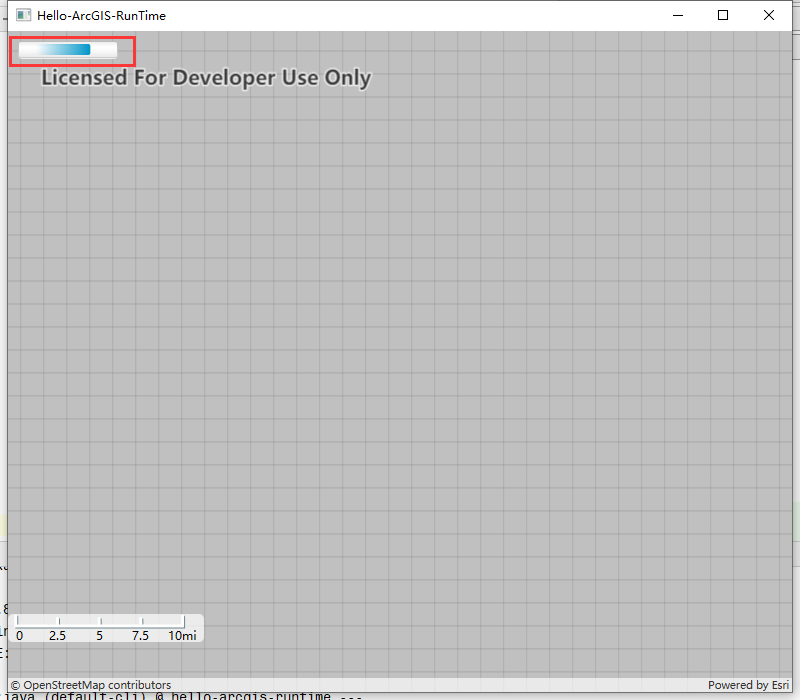
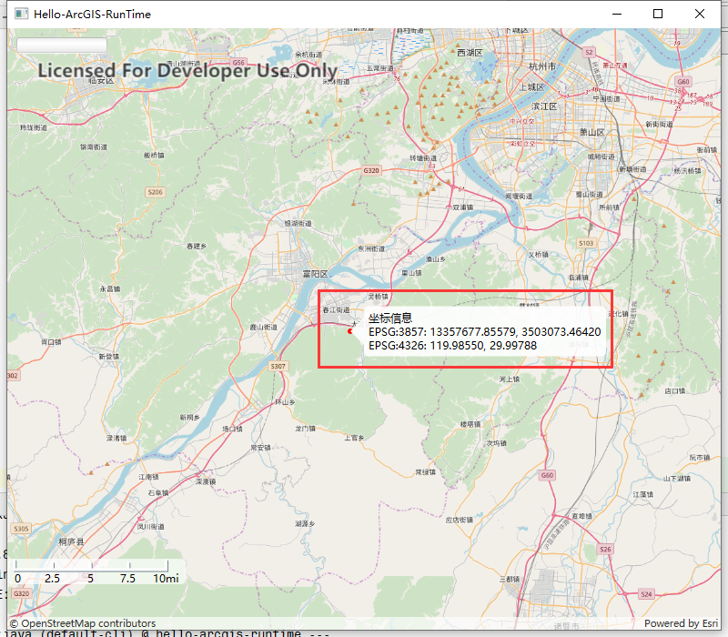

# hello-arcgis-runtime
## 依赖
- jdk>=11
- arcgis-java 100.5.0 
详细内容请查看[POM](pom.xml)
## 显示地图

- com.esri.arcgisruntime.mapping.view.MapView 用来装载地图的显示窗口

```java
package com.huifer.runtime.hello;

import javafx.application.Application;
import javafx.scene.Scene;
import javafx.scene.layout.StackPane;
import javafx.stage.Stage;

import com.esri.arcgisruntime.mapping.ArcGISMap;
import com.esri.arcgisruntime.mapping.Basemap;
import com.esri.arcgisruntime.mapping.view.MapView;

public class App extends Application {

    private MapView mapView;

    public static void main(String[] args) {

        Application.launch(args);
    }

    @Override
    public void start(Stage stage) {

        // 设置显示窗口大小以及标题
        stage.setTitle("Hello-ArcGIS-RunTime");
        stage.setWidth(800);
        stage.setHeight(700);
        stage.show();

        // 创建一个场景
        StackPane stackPane = new StackPane();
        Scene scene = new Scene(stackPane);
        stage.setScene(scene);

        // 将mapView放入StackPane
        mapView = new MapView();
        stackPane.getChildren().add(mapView);

        // 使用arcgis的BaseMap 地图
        ArcGISMap map = new ArcGISMap(Basemap.createOpenStreetMap());

        // mapView 显示地图
        mapView.setMap(map);
    }

    @Override
    public void stop() {

        if (mapView != null) {
            mapView.dispose();
        }
    }
}

```

- **注意POM文件需要修改**
```xml

        <groupId>org.codehaus.mojo</groupId>
        <artifactId>exec-maven-plugin</artifactId>
        <version>1.6.0</version>
        <executions>
          <execution>
            <goals>
              <goal>java</goal>
            </goals>
          </execution>
        </executions>
        <configuration>
<!--此处修改成你的Main函数所在的JAVA文件        -->
          <mainClass>com.huifer.runtime.hello.App</mainClass>
        </configuration>
      
```

## 启动
- 第一次启动需要优先执行 **arcgis-java:arcgis**
1. 执行 arcgis-java:arcgis
2. 执行 compile
3. 执行 exec:java




### debug 启动


经过设置就可以debug启动

## 显示范围
- 当我们将地图显示出来以后需要着重展示其中一块区域时，我们就需要给地图做一个显示范围的框选

1. 在初始化ArcGISMap 这个变量的时候进行设置
```java
        ArcGISMap map = new ArcGISMap(Type.OPEN_STREET_MAP,13386799.07543,3528340.69133,10);

```
2. 给ArcGISMap 设置setInitialViewpoint 属性值
```java
 /**
     * 改变窗口中心显示位置
     * @param map
     */
    private void changeViewPoint(ArcGISMap map) {
        Point leftPoint_4326 = new Point(120.00000, 30.000000, SpatialReference.create(4236));
        Point rightPoint_4326 = new Point(120.001, 30.0001, SpatialReference.create(4236));

        Point leftPoint = (Point) GeometryEngine
                .project(leftPoint_4326, SpatialReferences.getWebMercator());
        Point rightPoint = (Point) GeometryEngine.project(rightPoint_4326, SpatialReferences.getWebMercator());

        Envelope initialExtent = new Envelope(leftPoint, rightPoint);
        Viewpoint viewPoint = new Viewpoint(initialExtent);
        map.setInitialViewpoint(viewPoint);
    }
```


## 控件
### 比例尺
```java
    /**
     * 比例尺设置
     */
    private void createScaleBar(StackPane stackPane) {
        // 在mapView上创建一个比例尺
        Scalebar scaleBar = new Scalebar(mapView);

        // 设置比例尺样式
        scaleBar.setSkinStyle(Scalebar.SkinStyle.GRADUATED_LINE);

        // 设置比例尺单位
        scaleBar.setUnitSystem(UnitSystem.IMPERIAL);

        // 设置比例尺的可见性
        Color transparentWhite = new Color(1, 1, 1, 0.7);
        scaleBar.setBackground(new Background(
                new BackgroundFill(transparentWhite, new CornerRadii(5), Insets.EMPTY)));

        // 添加到 stackPane
        stackPane.getChildren().add(scaleBar);

        // 设置比例尺位置
        StackPane.setAlignment(scaleBar, Pos.BOTTOM_LEFT);
        // 比例尺填充
        StackPane.setMargin(scaleBar, new Insets(0, 0, 50, 0));
    }

```


### 进度条
```java
    /**
     * 显示进度条
     */
    private void createProgressBar(StackPane stackPane) {
        // 创建进度条
        ProgressBar progressBar = new ProgressBar();
        progressBar.setMaxWidth(100);

        mapView.addDrawStatusChangedListener(e -> {
            if (e.getDrawStatus() == DrawStatus.IN_PROGRESS) {
                // 检查是否还在加载中
                progressBar.setProgress(-100);

            } else if (e.getDrawStatus() == DrawStatus.COMPLETED) {
                // 检查是否加载完成
                progressBar.setProgress(100.0);
            }
        });

        //设置进度条放置位置并且添加到stackPane
        stackPane.getChildren().addAll(progressBar);
        StackPane.setAlignment(progressBar, Pos.TOP_LEFT);
        StackPane.setMargin(progressBar, new Insets(10, 0, 0, 10));
    }

```


## 地图点击
```java
    /**
     * 地图点击显示坐标
     */
    private void mapOnClick() {
        GraphicsOverlay graphicsOverlay = new GraphicsOverlay();
        mapView.getGraphicsOverlays().add(graphicsOverlay);
        final SimpleMarkerSymbol markerSymbol = new SimpleMarkerSymbol(
                SimpleMarkerSymbol.Style.CIRCLE, 0xFFFF0000, 5);
        Graphic inputPointGraphic = new Graphic();
        inputPointGraphic.setSymbol(markerSymbol);
        graphicsOverlay.getGraphics().add(inputPointGraphic);

        DecimalFormat decimalFormat = new DecimalFormat("#.00000");
        mapView.setOnMouseClicked(e -> {
            if (e.isStillSincePress() && e.getButton() == MouseButton.PRIMARY) {
                Point2D point2D = new Point2D(e.getX(), e.getY());
                // 画一个点来表示当前点选的位置
                Point originalPoint = mapView.screenToLocation(point2D);
                inputPointGraphic.setGeometry(originalPoint);
                // 坐标的一个转换
                Point projectedPoint = (Point) GeometryEngine
                        .project(originalPoint, SpatialReference.create(4236));
                // 弹窗显示
                Callout callout = mapView.getCallout();
                callout.setTitle("坐标信息");
                String ox = decimalFormat.format(originalPoint.getX());
                String oy = decimalFormat.format(originalPoint.getY());
                String px = decimalFormat.format(projectedPoint.getX());
                String py = decimalFormat.format(projectedPoint.getY());
                callout.setDetail(
                        "EPSG:3857: " + ox + ", " + oy + "\n" + "EPSG:4326: " + px + ", " + py);
                callout.showCalloutAt(inputPointGraphic, originalPoint);
            }
        });
    }

```

